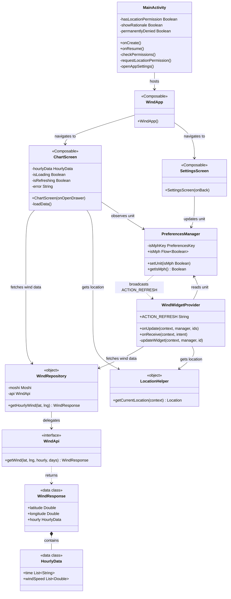
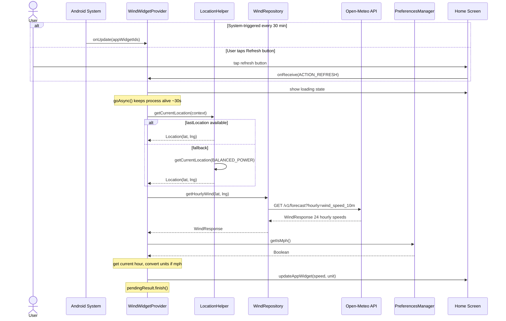
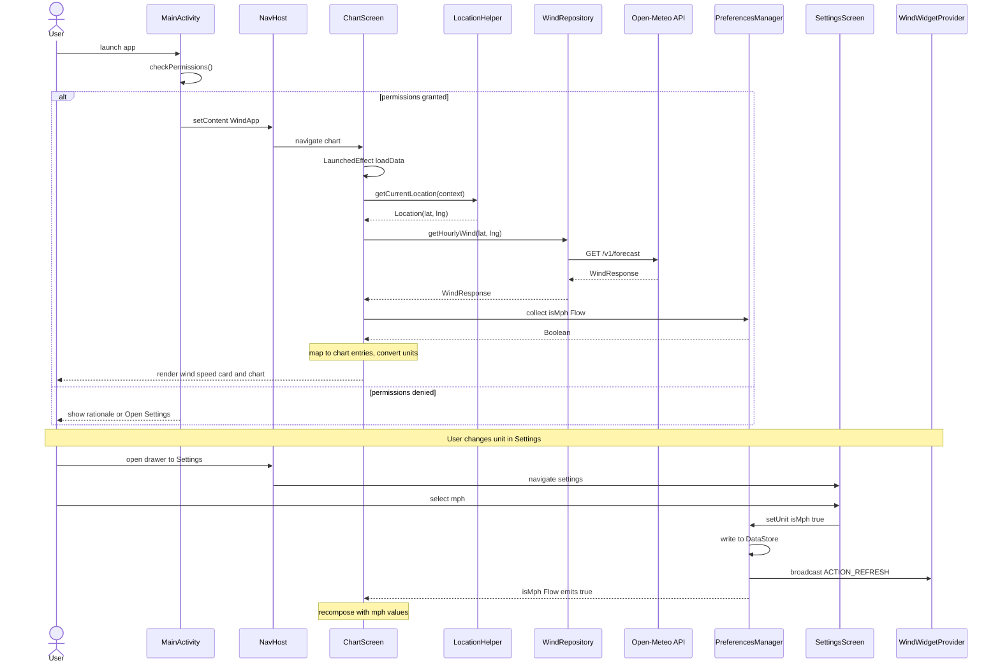

# Android Wind Widget

A lightweight Android home screen widget and companion app that displays real-time wind speed for your current location, powered by the [Open-Meteo](https://open-meteo.com/) free weather API.

---

## Features

- **Home screen widget** — shows current wind speed, updates every 30 minutes or on manual refresh
- **Lock screen support** — widget is available on the keyguard
- **Companion app** — full 24-hour hourly wind speed chart via Vico
- **Unit toggle** — switch between km/h and mph; persisted across sessions and instantly reflected in widget
- **Dark mode** — full Material You / Material 3 theming with dynamic color (Android 12+)
- **No API key required** — uses the public Open-Meteo API

---

## Screenshots

> _Add screenshots here_

---

## Architecture Overview

The app follows a layered architecture:

| Layer | Components |
|-------|-----------|
| **UI** | `MainActivity`, `WindApp`, `ChartScreen`, `SettingsScreen` (Jetpack Compose) |
| **Widget** | `WindWidgetProvider` (AppWidgetProvider) |
| **Data** | `WindRepository`, `WindApi` (Retrofit + Moshi), `PreferencesManager` (DataStore) |
| **Location** | `LocationHelper` (Fused Location Provider) |
| **Models** | `WindResponse`, `HourlyData` |

### Key Design Decisions

- **`goAsync()`** is used in the widget's `onReceive`/`onUpdate` handlers to keep the process alive while performing network and location I/O (~30 s budget), avoiding ANR without requiring a foreground service.
- **`SupervisorJob`** in the widget's coroutine scope prevents a single child failure (e.g. network error) from cancelling the entire scope.
- **`PreferencesManager.setUnit()`** broadcasts `ACTION_REFRESH` to the widget after saving to DataStore, so the widget immediately re-renders in the new unit.
- **Dynamic color** (Material You) is applied on Android 12+ while falling back to a static blue/teal palette on older versions.

---

## Class Diagram



---

## Sequence Diagram — Widget Update Flow



---

## Sequence Diagram — App: Chart Screen Load



---

## Data Flow

```
User Location (GPS/Network)
        │
        ▼
  LocationHelper
        │  lat/lng
        ▼
  WindRepository ──► Open-Meteo API ──► WindResponse
        │                                    │
        │                              HourlyData
        │                          (24 × wind_speed_10m)
        ▼
 ┌──────────────┐          ┌──────────────────────┐
 │  ChartScreen │          │  WindWidgetProvider   │
 │  (full chart)│          │  (current-hour value) │
 └──────────────┘          └──────────────────────┘
        ▲                           ▲
        │                           │
 PreferencesManager (DataStore) ────┘
   isMph: Flow<Boolean>
```

---

## Tech Stack

| Category | Library / Tool |
|----------|---------------|
| Language | Kotlin 1.9.22 |
| Min SDK | 26 (Android 8.0) |
| Target SDK | 34 (Android 14) |
| UI | Jetpack Compose + Material 3 |
| Navigation | Compose Navigation 2.7.6 |
| Networking | Retrofit 2.9.0 |
| JSON | Moshi 1.15.0 + KotlinJsonAdapterFactory |
| Charts | Vico (Compose M3) 1.15.0 |
| Location | Google Play Services Location 21.0.1 |
| Persistence | DataStore Preferences 1.0.0 |
| Async | Kotlin Coroutines 1.7.3 |
| Lifecycle | Lifecycle ViewModel Compose 2.7.0 |
| Build | Gradle 8.2.2, AGP 8.2.2, JVM 17 |

---

## Project Structure

```
app/src/main/
├── java/com/example/windwidget/
│   ├── MainActivity.kt            — Entry point, permission management
│   ├── data/
│   │   ├── WindApi.kt             — Retrofit interface (Open-Meteo)
│   │   ├── WindResponse.kt        — API response data models
│   │   ├── WindRepository.kt      — Singleton repository (Retrofit + Moshi)
│   │   └── PreferencesManager.kt  — DataStore wrapper (unit preference)
│   ├── location/
│   │   └── LocationHelper.kt      — Fused Location Provider helper
│   ├── ui/
│   │   ├── WindApp.kt             — Nav host + drawer
│   │   ├── ChartScreen.kt         — Wind chart + current conditions
│   │   ├── SettingsScreen.kt      — Unit selection
│   │   └── theme/
│   │       └── Theme.kt           — Material 3 color schemes
│   └── widget/
│       └── WindWidgetProvider.kt  — AppWidgetProvider (home/lock screen widget)
└── res/
    ├── layout/
    │   └── widget_wind.xml        — Widget RemoteViews layout
    ├── drawable/
    │   ├── widget_background.xml  — Rounded white background
    │   └── ic_refresh.xml         — Refresh icon
    └── xml/
        └── wind_widget_info.xml   — Widget metadata (size, update period, categories)
```

---

## Getting Started

### Prerequisites

- Android Studio Hedgehog (2023.1.1) or later
- Android device or emulator with API 26+
- Location permissions granted at runtime

### Build & Run

```bash
# Clone the repository
git clone https://github.com/<your-username>/Android-Wind-Widget.git
cd Android-Wind-Widget

# Build debug APK
./gradlew assembleDebug

# Install on connected device
./gradlew installDebug
```

### Adding the Widget

1. Long-press on your home screen
2. Select **Widgets**
3. Find **Wind Widget** and drag it to your home screen
4. Grant location permission if prompted

---

## API

Wind data is fetched from [Open-Meteo](https://open-meteo.com/) — a free, open-source weather API with no authentication required.

**Endpoint:**
```
GET https://api.open-meteo.com/v1/forecast
  ?latitude={lat}
  &longitude={lng}
  &hourly=wind_speed_10m
  &forecast_days=1
```

**Response excerpt:**
```json
{
  "latitude": 51.5,
  "longitude": -0.12,
  "hourly": {
    "time": ["2024-03-28T00:00", "2024-03-28T01:00", ...],
    "wind_speed_10m": [12.3, 11.8, 13.1, ...]
  }
}
```

---

## License

This project is open source. See [LICENSE](LICENSE) for details.
